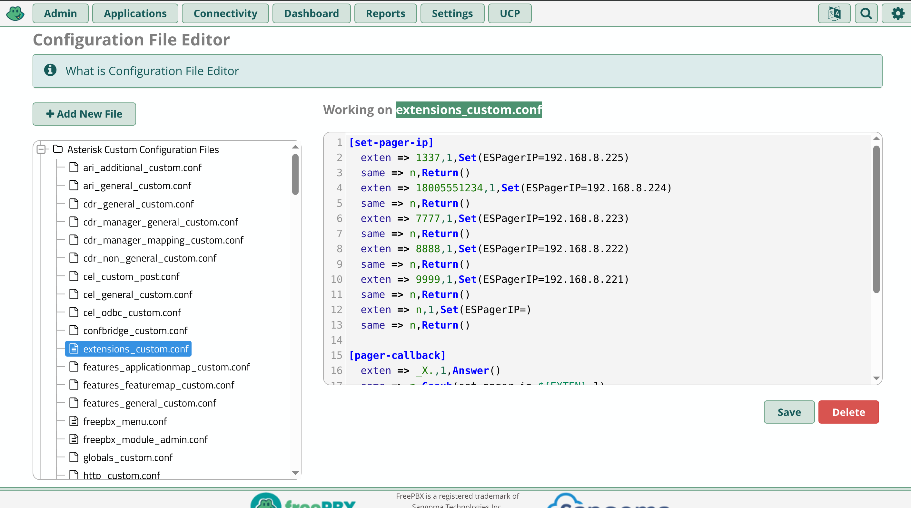
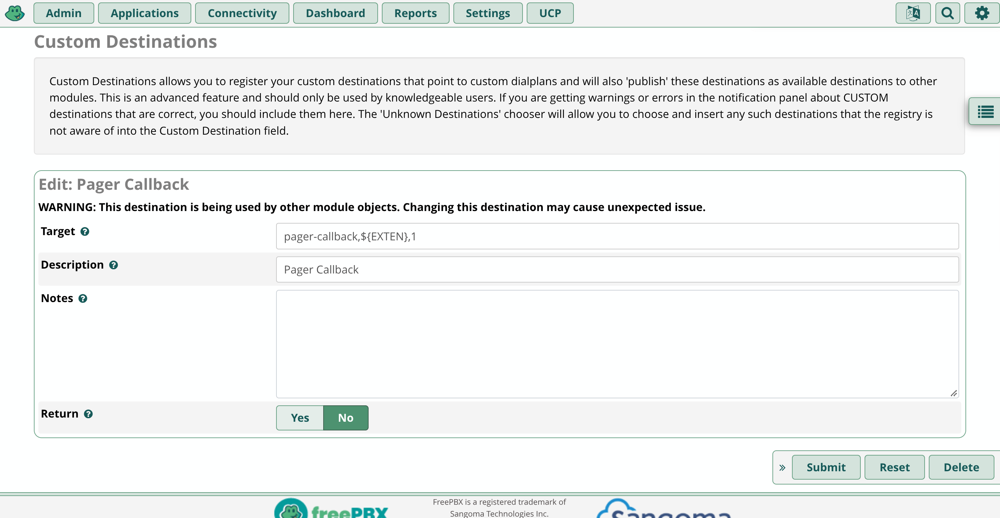
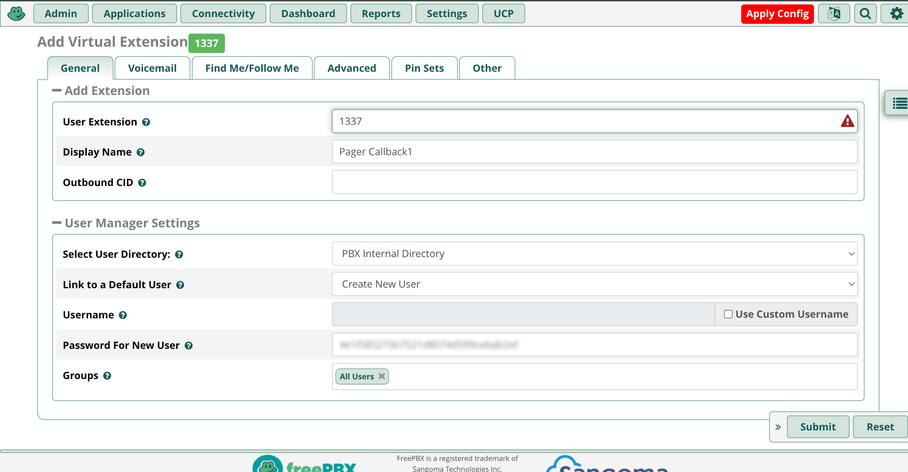
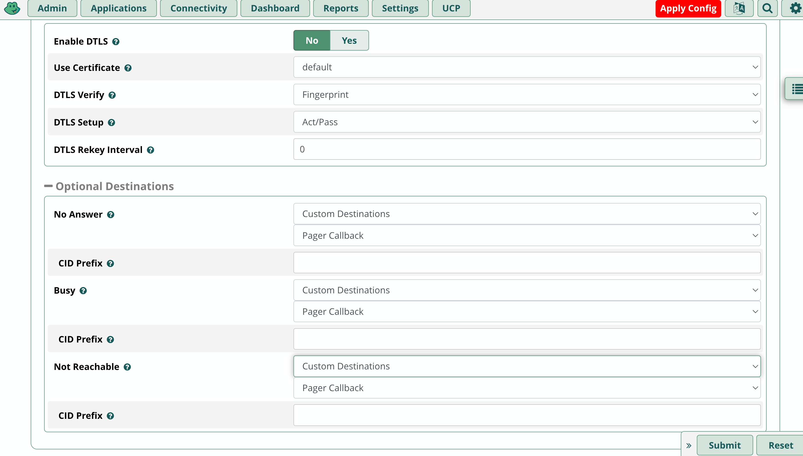

----------
STEP 1: Add Custom Dialplan  
----------
<a href="config_edit.png">
  
</a>
<br>
Admin->Config Edit->extensions_custom.conf  

```
[set-pager-ip]
  exten => 1337,1,Set(ESPagerIP=192.168.8.225)
  same => n,Return()
  exten => 18005551234,1,Set(ESPagerIP=192.168.8.224)
  same => n,Return()
  exten => 7777,1,Set(ESPagerIP=192.168.8.223)
  same => n,Return()
  exten => 8888,1,Set(ESPagerIP=192.168.8.222)
  same => n,Return()
  exten => 9999,1,Set(ESPagerIP=192.168.8.221)
  same => n,Return()
  exten => n,1,Set(ESPagerIP=)
  same => n,Return()

[pager-callback]
  exten => _X.,1,Answer()
  same => n,Gosub(set-pager-ip,${EXTEN},1)
  same => n,Flite(Please enter your call back number followed by the pound key)
  same => n,Set(TIMEOUT(digit)=5)
  same => n,Set(TIMEOUT(response)=10)
  same => n,Read(CALLBACKNUM,,#)
  same => n,Verbose(1,Callback number received: ${CALLBACKNUM})
  same => n,Set(CURL_RESULT=${CURL(http://${ESPagerIP}/pocsag?msg=${CALLBACKNUM})})
  same => n,Flite(Your call back number has been sent to the pager Goodbye)
  same => n,Hangup()
```

Save and Apply Config  

Note: I have manually installed and loaded the Flite app via command line as my TTS engine, you may find it easier to use prerecorded wav files as your voice prompts.  

If you do not wish to use Flite then replace instances of:  
```
same => n,Flite(Spoken Text)
```
With:  
```
same => n,Playback(my-recording)
```

----------
STEP 2: Add Custom Destination  
----------
<a href="custom_destinations.png">
  
</a>
<br>
Admin->Custom Destinations->Add Destination  

Target:  
```
pager-callback,${EXTEN},1
```
Description:  
```
Pager Callback
```

Submit and Apply Config  

----------
STEP 3: Add Custom Extension  
----------
<a href="add_extension_1.png">
  
</a>
<a href="add_extension_2.png">
  
</a>
<br>
Connectivity->Extensions->Add Extension->Add Virtual Extension  

General:  

User Extension:  
```
1337
```
Display Name:  
```
Pager Callback 1
```
Advanced:  
For No Answer, Busy, and Not Reachable choose Custom Destination->Pager Callback  

Submit and Apply Config  
